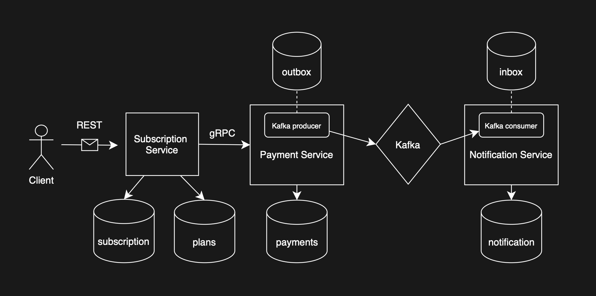

# Subscription Service [](https://github.com/unt1tledd/subscription/actions/workflows/ci.yml)

Учебный проект системы управления подписками, построенный на микросервисной архитектуре.

## ТехСтек

- Java 21
- Spring Boot
- Spring Data JPA
- PostgreSQL
- Flyway
- gRPC
- Apache Kafka
- Docker Compose
- Maven
- JUnit 5
- Mockito
- Testcontainers

## Архитектура



Основной поток:

1. Клиент создаёт подписку через REST API.
2. `Subscription Service` вызывает `Payment Service` по gRPC.
3. `Payment Service` сохраняет платёж и событие в `outbox_events` в одной транзакции.
4. Outbox worker публикует событие в Kafka.
5. `Notification Service` получает событие и регистрирует его в `inbox_events`.
6. После дедупликации создаётся уведомление.

## Services

### Subscription Service

Отвечает за:

- управление тарифами;
- создание и получение подписок;
- управление автопродлением;
- запуск оплаты подписки;
- идемпотентность REST-запросов.

Взаимодействует с `Payment Service` по gRPC.

### Payment Service

Отвечает за:

- создание платежей;
- идемпотентную обработку повторных запросов;
- проверку статуса зависших платежей;
- публикацию событий через Transactional Outbox.

Для имитации внешнего платёжного провайдера используется `FakePaymentProcessor`.

### Notification Service

Отвечает за:

- получение событий из Kafka;
- дедупликацию через Inbox Pattern;
- создание уведомлений;
- retry и отправку необработанных сообщений в DLT.

## Запуск приложения

Требуются Docker и Docker Compose.

```bash
git clone https://github.com/unt1tledd/subscription.git
cd subscription
docker compose up --build
```

После запуска REST API доступен по адресу:

```text
http://localhost:8081
```

Остановить приложение:

```bash
docker compose down
```

Удалить контейнеры вместе с данными:

```bash
docker compose down -v
```

## API примеры

### Create a plan

```bash
curl -X POST http://localhost:8081/api/v1/plans \
  -H "Content-Type: application/json" \
  -d '{
    "code": "PREMIUM_MONTHLY",
    "name": "Premium Monthly",
    "price": 49900,
    "currency": "RUB",
    "durationDays": 30
  }'
```

Стоимость передаётся в минимальных денежных единицах. Например, `49900` — это `499.00 RUB`.

### Create a subscription

```bash
curl -X POST http://localhost:8081/api/v1/subscriptions \
  -H "Content-Type: application/json" \
  -H "Idempotency-Key: subscription-001" \
  -d '{
    "userId": 1,
    "planCode": "PREMIUM_MONTHLY",
    "autoRenew": true
  }'
```

### Checkout a subscription

```bash
curl -X POST http://localhost:8081/api/v1/subscriptions/{subscriptionId}/checkout \
  -H "Content-Type: application/json" \
  -H "Idempotency-Key: payment-001" \
  -d '{
    "paymentMethodId": "test-card"
  }'
```

Для имитации неуспешного платежа:

```json
{
  "paymentMethodId": "test-failed"
}
```

### Get a subscription

```bash
curl http://localhost:8081/api/v1/subscriptions/{subscriptionId}
```

### Get user subscriptions

```bash
curl "http://localhost:8081/api/v1/subscriptions?userId=1&page=0&size=10"
```

## Тесты

Запуск всех unit- и integration-тестов:

```bash
./mvnw clean verify
```

Интеграционные тесты используют Testcontainers и автоматически запускают PostgreSQL и Kafka.

В проекте проверяются:

- REST API `Subscription Service`;
- gRPC-взаимодействие с `Payment Service`;
- публикация событий из Outbox в Kafka;
- обработка событий и Inbox-дедупликация;
- создание уведомлений.

## Reliability patterns

В проекте реализованы:

- Transactional Outbox;
- Inbox Pattern;
- идемпотентность запросов;
- optimistic locking;
- Kafka retry и Dead Letter Topic;
- восстановление зависших Outbox-событий;
- отдельная база данных для каждого сервиса.
- AOP-логирование методов контроллеров и времени выполнения запросов;
